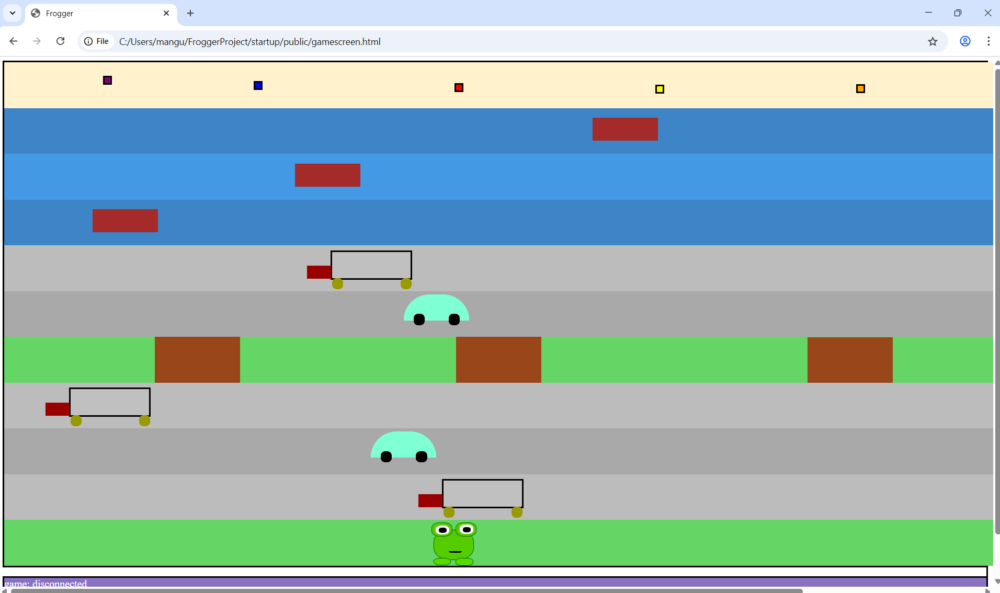

# Multiplayer Frogger

Imagine you are all alone in your basement, trying to get the absolute perfect run. You've spent hours hopping across lily pads and side-stepping semi-trucks. You finally did it! A new high score! All is well in the world. And then your grandpa scoffs from the back of the room, saying that he can do it better. A direct challenge to your pride. You must respond.

Now presenting **multiplayer Frogger**! :frog: This is a remake of the classic arcade game, with the addition of a multiplayer interface! :frog: :frog: Different players can each login to the game with their personal froggy and try their hand at the course! The frogs will then maneuver themselves through the obstacles, trying to reach the end of the course. Think you have what it takes to beat your grandpa? Come play and find out!

May the best froggy win! Watch out for cars! 🚙

Some features include:

- login to the server, create and name your frog
- live in-game chat
- first player to complete the game (cross the obstacles into the safe zone five times) wins
- if you get run over or drown three times, you lose

Frogger: https://startup.warrenfrogger.click/
Simon: https://simon.warrenfrogger.click/
About Me: https://warrenfrogger.click/

## Startup Notes

I've had a lot of fun (and a little bit of sweat) learning the different CSS elements. I combined different elements together to create a frog, a truck, a car, and some other stuff! I also played around with the borders of the page for a while (using flex and relative), even though they are still a little off. I've learned that changing even one tiny detail in the CSS can completely throw off the entire page, so I'm not sure if I'll change it much more. But still I think it's super cool that you can have so much customizaiton.

JavaScript is a load of fun. So far I've added movement abilities for the frog (WASD), which is a little glitchy but works overall. You can move over to the flies on the far side of the map and "eat" them, which will send you back to the front (don't worry though, they'll be back once you're done). I also spent a while customizing the movement of the trucks and cars. I just added collisions, which will kill your frog and send him back to the start. You can ride along the logs as well! I've learned that you have to be very specific about exactly where the left and top elements are located in order for the server to register a connection.

Implementing the next step was the hardest yet. I got a random quote placed onto the front page following the given example, which actually looked a lot better than I thought it would. I was able to get a database registered and connected to my login credentials (which is just a password you enter). I wasn't able to encrypt the password, but I still was happy with that outcome. I then continued by adding some functionality to the live chat at the bottom of the gamescreen. When someone wins the game (who isn't yourself), a message is sent in the chat. I haven't figured out how to personalize that message yet. Overall this step was difficult but I learned a lot and I played a lot of Frogger in the process.
